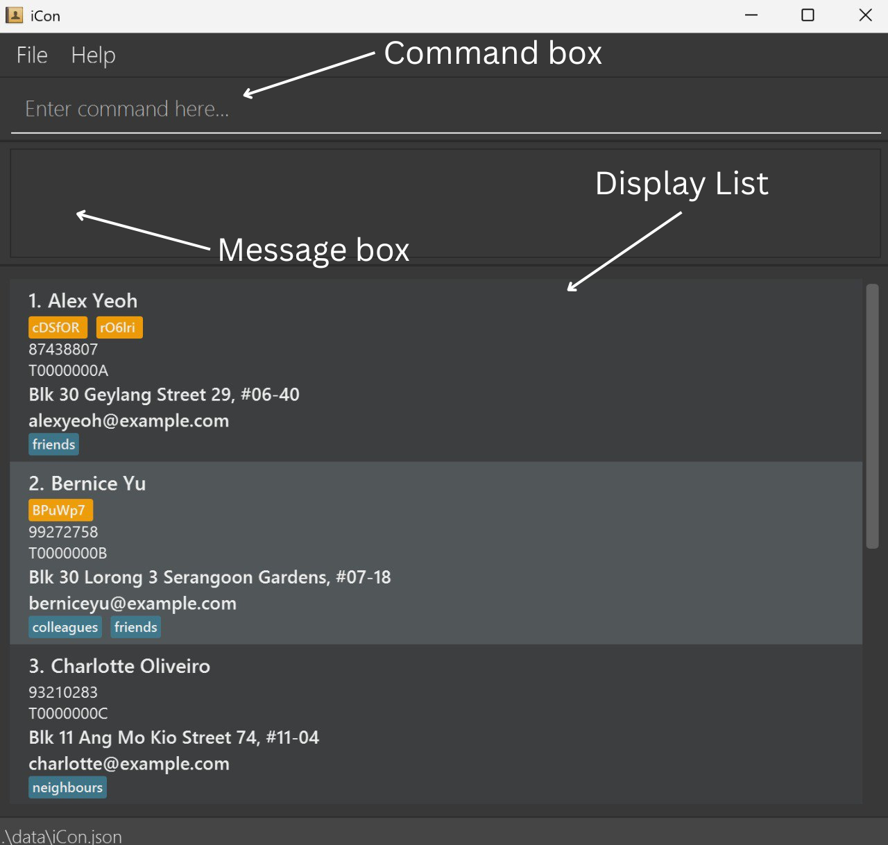

* This is **Team CS2103T-T15-2's sample project for Software Engineering (SE) students**. 
  Example usages:
* as a starting point of a course project (as opposed to writing everything from scratch)
* as a case study
* The project simulates an ongoing software project for a desktop application (called _AddressBook_) used for managing contact details.
* It is **written in OOP fashion**. It provides a **reasonably well-written** code base **bigger** (around 6 KLoC) than what students usually write in beginner-level SE modules, without being overwhelmingly big.
* It comes with a **reasonable level of user and developer documentation**.
* It is named `iCon` (an abbreviation for Insurance Contacts and Contracts) because it is an application meants for insurance agents to store their contacts and contracts.
* This project is a **part of the se-education.org** initiative. If you would like to contribute code to this project, see [se-education.org](https://se-education.org/#contributing-to-se-edu) for more info.
