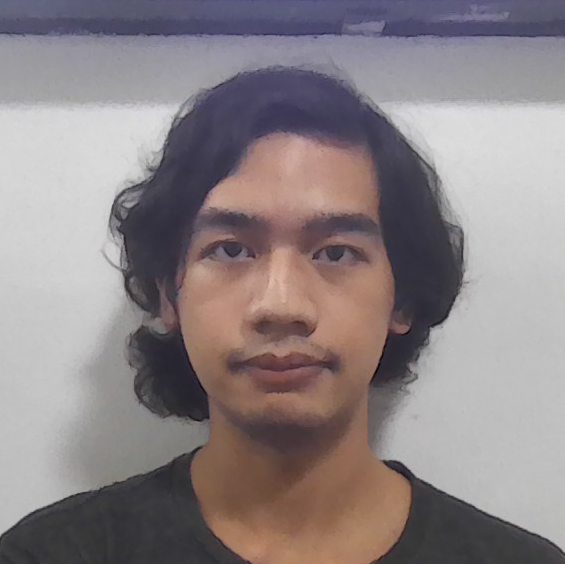
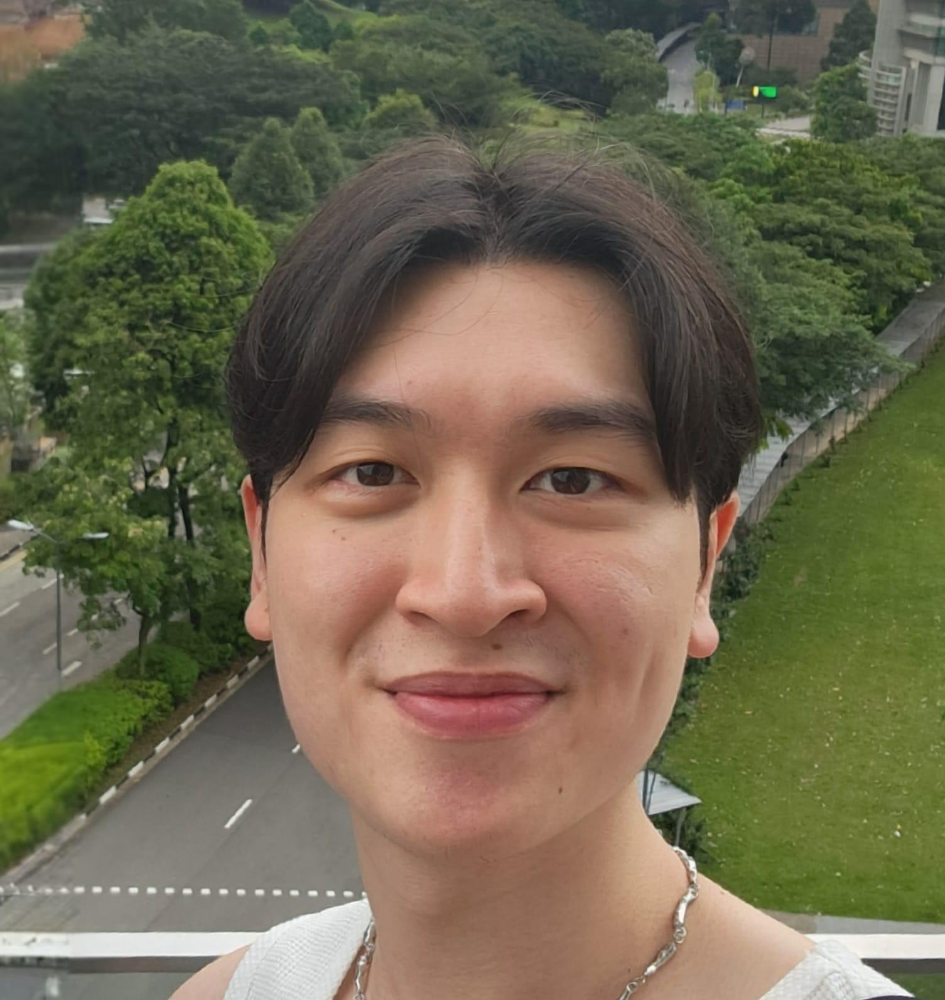
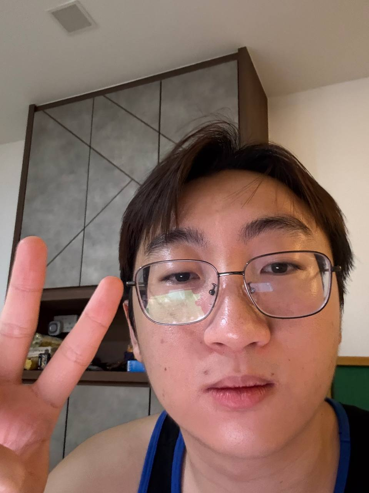
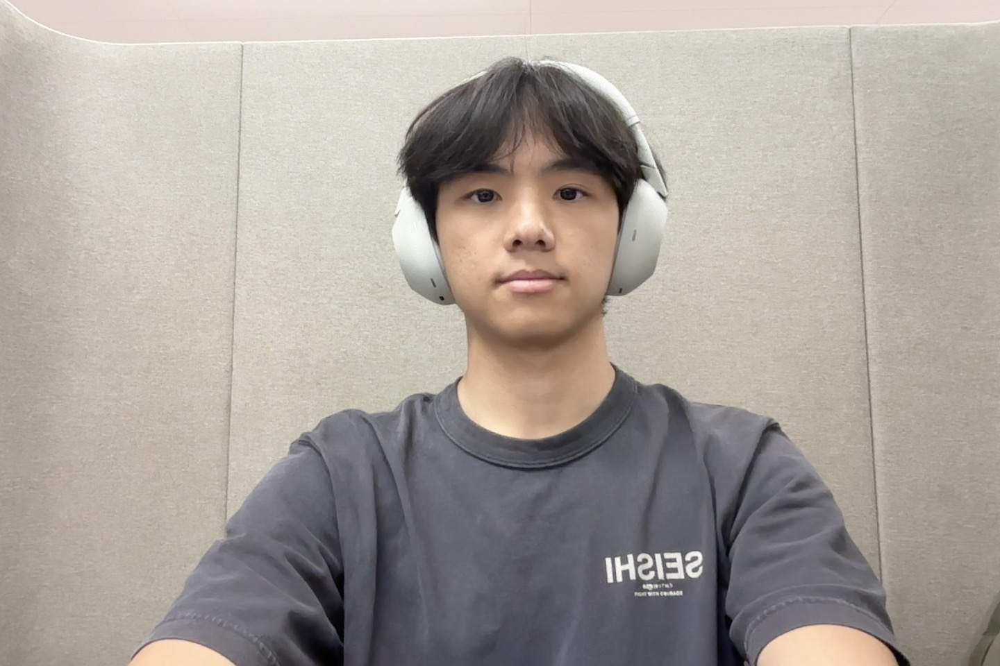
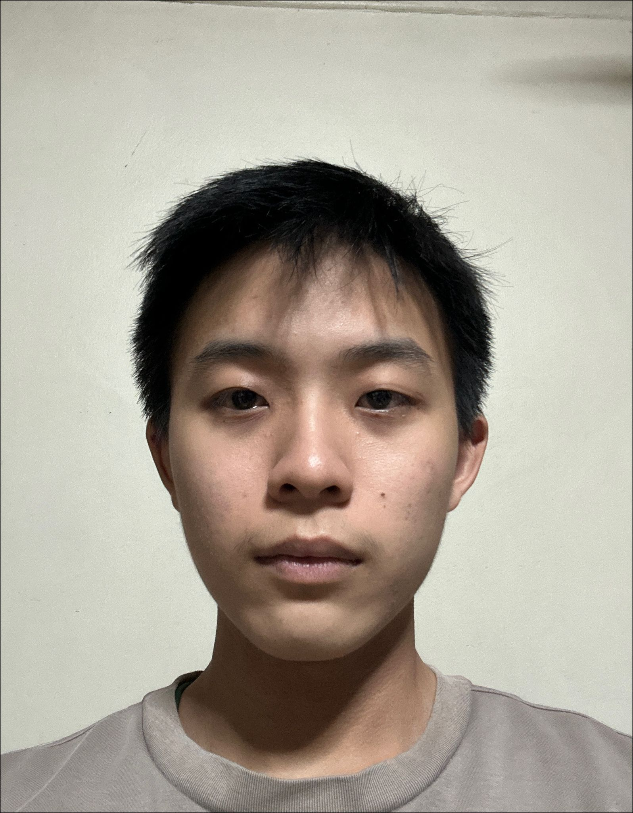

# About Us

We are a team based in the [School of Computing, National University of Singapore](http://www.comp.nus.edu.sg).

## Project team

### Andres Gonzales III

[[github](https://github.com/andrescuiii-too)]
[[portfolio](team/johndoe.md)]

* Role: Developer
* Responsibilities : Policy

### Damien

[[github](http://github.com/porcupinezzz)]
[[portfolio](team/johndoe.md)]

* Role: Developer
* Responsibilities : Contact

### Glendon Goh

[[github](http://github.com/eggie23)] [[portfolio](team/johndoe.md)]

* Role: Developer
* Responsibilities: Contract

### Joshua Seah

[[github](http://github.com/Joshua-Seah)]
[[portfolio](team/johndoe.md)]

* Role: Developer
* Responsibilities: Contract

### Tan Keng Hong

[[github](http://github.com/KH-boop-bit)]
[[portfolio](team/johndoe.md)]

* Role: Team Leader
* Responsibilities : Appointment, Policy
