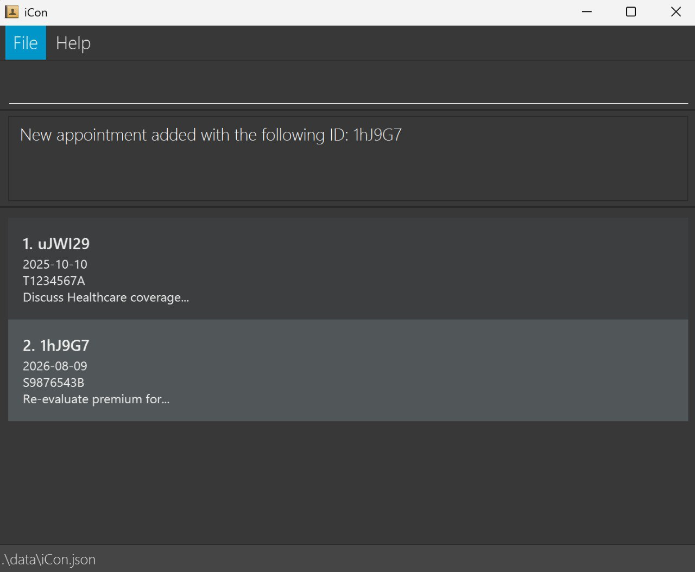
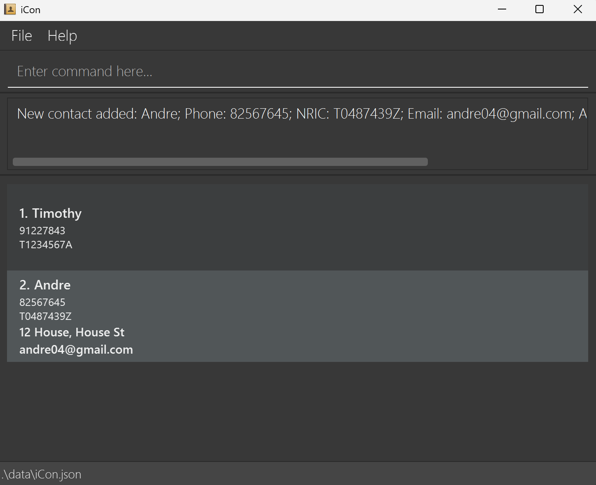
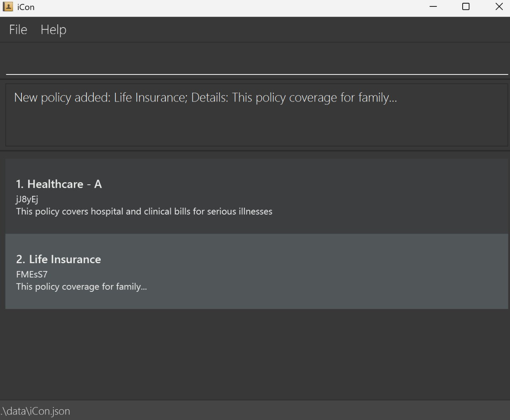
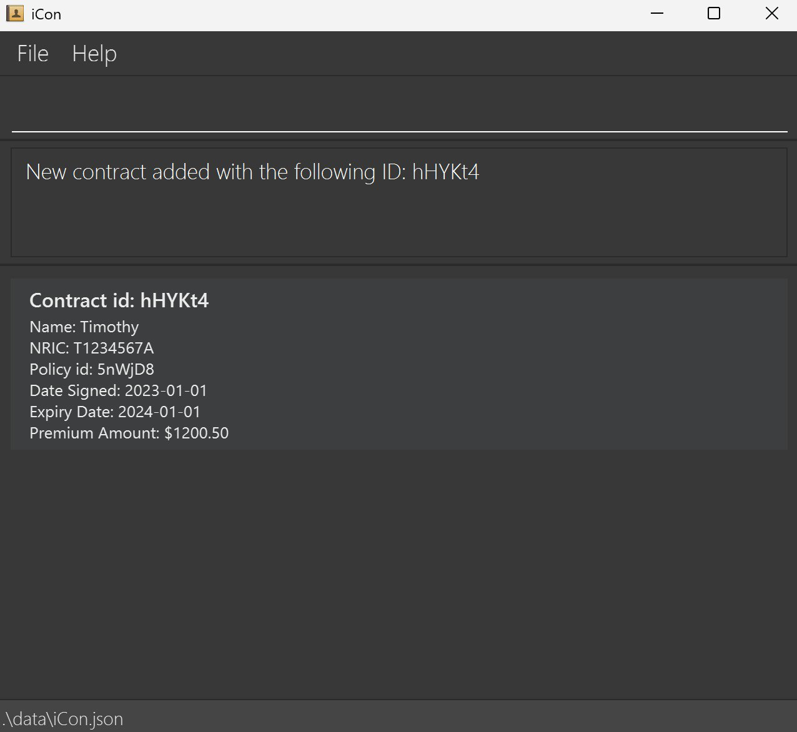

# iCon User Guide

iCon is a **desktop app for Insurance agents to manage contacts, contracts, policies, and appointments. It is optimized for use via a Command Line Interface** (CLI) while still having the benefits of a Graphical User Interface (GUI). If you can type fast, iCon can get your management tasks done faster than traditional GUI apps.

## Table of Contents

- [Quick start](#quick-start)
- [Features](#features)
- [Appointment](#appointment)
- [Contacts](#contacts)
- [Policy](#policy)
- [Contracts](#contracts)
- [General](#general)
- [FAQ](#faq)
- [Known issues](#known-issues)
- [Command summary](#command-summary)
- [Format summary](#format-summary)
- [Glossary](#glossary)

--------------------------------------------------------------------------------------------------------------------

## Quick start

1. Ensure you have Java `17` or above installed in your computer.<br>
   **Mac users:** Ensure you have the precise JDK version prescribed [here](https://se-education.org/guides/tutorials/javaInstallationMac.html).

1. Download the latest `.jar` file from [here](https://github.com/AY2526S1-CS2103T-T15-2/tp/releases).

1. Copy the file to the folder you want to use as the _home folder_ for iCon.

1. Open a command terminal, `cd` into the folder you put the jar file in, and use the `java -jar iCon.jar` command to run the application.<br>
   A GUI similar to the below should appear in a few seconds. Note how the app contains some sample data.<br>
   

1. Type the command in the command box and press Enter to execute it. e.g. typing **`help`** and pressing Enter will open the help window.<br>
   Some example commands you can try:

   * `add_contact n:John Doe p:98765432 ic:T0000000A e:johnd@example.com a:John street, block 123, #01-01` : Adds a contact named `John Doe` to iCon.

   * `remove_contact ic:T0000000A` : Removes the contact with NRIC `T0000000A`.

   * `clear` : Deletes all data.

   * `exit` : Exits the app.

1. Refer to the [Features](#features) below for details of each command.

--------------------------------------------------------------------------------------------------------------------

# Features

<box type="info" seamless>

**Notes about the command format:**<br>

* Words in `UPPER_CASE` are the compulsory parameters to be supplied by the user.<br>
  e.g. in `add_contact n:NAME p:PHONE_NUMBER ic:NRIC`, `NAME`, `PHONE_NUMBER` and `NRIC` are compulsory parameters which can be used as `add_contact n:John Doe p:91234567 ic:T0000000A`.

* Items in square brackets are optional.<br>
  e.g `n:NAME [t:TAG]` can be used as `n:John Doe t:friend` or as `n:John Doe`.

* Items with `…`​ after them can be used multiple times including zero times.<br>
  e.g. `[t:TAG]…​` can be used as ` ` (i.e. 0 times), `t:friend`, `t:friend t:family` etc.

* Parameters can be in any order.<br>
  e.g. if the command specifies `n:NAME p:PHONE_NUMBER`, `p:PHONE_NUMBER n:NAME` is also acceptable.

* Extraneous parameters for commands that do not take in parameters (such as `help`, `exit` and `clear`) will be ignored.<br>
  e.g. if the command specifies `help 123`, it will be interpreted as `help`.

* Text entered after certain parameters will be counted as we do not perform regex(format validation) on some fields. <br>Fields that can
  be checked - (Phone, NRIC, Email, ContractId, AppointmentId, PolicyId, Premium) - will throw exceptions for incorrect input format,
  but other fields' formats cannot be checked - (Name, Address, Tag), thus any input after the colon will be counted (within the confines of [defined accepted input](#format-summary)).
  <br> For example, `add_contact n: REAL_NAME OOPS_EXTRA_TEXT p:....` will
  include the extra text in your name. *e.g. NRIC would be checked if it matches the format starting with T/S/F/G/M, followed by 7 digits,
  and then a final letter, this is what we mean by format validation*.

* If you are using a PDF version of this document, be careful when copying and pasting commands that span multiple lines as space characters surrounding line-breaks may be omitted when copied over to the application.
  </box>

## Appointment

### Adding an appointment: `add_appointment`

Adds an appointment to iCon.

Format: `add_appointment ic:NRIC dt:APPOINTMENTDATE d:APPOINTMENTDETAILS`

* Appointment date allows past and present dates for historical tracking purposes.
* NRIC of contact must exist in iCon at the current point in time.

Examples:
* `add_appointment ic:T1234567A dt:2025-10-10 d:Discuss Healthcare coverage...`
* `add_appointment ic:S9876543B dt:2026-08-09 d:Re-evaluate premium for...`

**Note:**
* Appointments are considered duplicates and are not added to iCon if they have the **EXACT** same NRIC, date, and details.\
Therefore it is possible to have, for example, two similar appointments with details differing in case such as:
  * `ic:T1234567a dt:2025-10-10 dt:Discuss...`; and
  * `ic:T1234567a dt:2025-10-10 dt:discuss...`



### Viewing appointment(s): `view_appointment`

Display appointment(s) in iCon, either all or a set of specific appointments.

Format: 
1. `view_appointment -a` view all appointments
2. `view_appointment a:APPOINTMENT_ID1 [APPOINTMENT_ID2] [APPOINTMENT_ID3]...` at least 1 ID to view

Examples:
* `view_appointment -a`
* `view_appointment a:ABCDEF`

**Note:**
* Viewing appointment(s) by ID allows multiple case-sensitive, ID substrings separated by the space character " ".

### Editing an appointment : `edit_appointment`

Edits an existing appointment in iCon.

Format: `edit_appointment a:APPOINTMENT_ID [ic:NRIC] [dt:APPOINTMENTDATE] [d:APPOINTMENTDETAILS]` 

* Edits the appointment at the specified `a:`. The appointment ID refers to the ID number shown in the displayed appointment list. The appointment ID **must be alphanumeric and 6 characters** …​
* At least one of the optional fields must be provided.
* Existing values of selected optional field(s) will be updated (overwritten) to the new input values.
* Appointment Date allows past and present dates for historical tracking purposes.
* NRIC of contact must exist in iCon at the current point in time.


Examples:
*  `edit_appointment a:abc123 ic:T1234567A` Edits the Nric of the appointment with ID 'abc123' to be T1234567A.
*  `edit_appointment a:456XYZ dt:2020-01-01 d:This...` Edits the appointment date and appointment details of the appointment with ID '456XYZ' to 2020-01-01 and "This..." respectively.

**Note:**
* Duplicate appointments are similarly checked as in [`add_appointment`](#adding-an-appointment--addappointment) and are rejected.

### Removing an appointment : `remove_appointment`

Removes the specified appointment from iCon.

Format: `remove_appointment a:APPOINTMENT_ID`

* Removes the appointment with the specified `APPOINTMENT_ID`.
* The appointment ID refers to the appointment ID shown in the displayed appointment list.
* The appointment ID **must be alphanumeric and 6 characters long** …​

Examples:
* `remove_appointment a:xyz123` removes the appointment with appointment ID "xyz123" in iCon.

### Sorting appointments : `sort_appointment`

Sorts the appointments in iCon by relevant flags.

Format: `sort_appointment`
1. `sort_appointment -i` sort appointment by order in which appointment was inserted/added into iCon.
2. `sort_appointment -a` sort appointment by the ID's alphabetical order.
3. `sort_appointment -da` sort appointment by date in ascending order.
4. `sort_appointment -dd` sort appointment by date in descending order.

* Insertion order is the order in which appointments are added by the user.


## Contacts

### Adding contacts : `add_contact`

Adds a contact to iCon.

Format: `add_contact n:NAME p:PHONE_NUMBER ic:NRIC [e:EMAIL] [a:ADDRESS] [t:TAG]...`

Examples:

* `add_contact n:Timothy p:91227843 ic:t1234567a`
* `add_contact n:Andre p:82567645 ic:t0487439z e:andre04@gmail.com a:12 House, House St`



### Editing contacts : `edit_contact`

Edits a contact in iCon.

Format: `edit_contact ic:NRIC [n:NAME] [p:PHONE_NUMBER] [e:EMAIL] [a:ADDRESS] [t:TAG]...`

Examples:

* `edit_contact ic:T1234567A n:Tom`
* `edit_contact ic:T0000000B p:98539870`

**Note:**
* This command completely overwrites previous data entered.
* For all optional fields - tags, email, address - you may remove such fields by not keying any text 
after the prefix - `t:`, `e:`, `a:` - e.g `edit_contact ic:NRIC t:`
* At least one of the optional fields must be provided if not an error will be shown <br> E.g.: `edit_contact ic:T1234567A` will show an error message <br> But `edit_contact ic:T1234567A n:Tom` will work

### Removing contacts : `remove_contact`

Removes a contact in iCon.

Format: `remove_contact ic:NRIC`

Examples:

* `remove_contact ic:t1234567a`
* `remove_contact ic:T1234567B`

**Note:**
* Contact cannot be removed if there is a contract or appointment linked to the contact.
* MessageBox will always display existence of contracts (if any) first, before displaying existence of appointments (if any).

### Sorting contacts : `sort_contact`

Sorts contacts in iCon by relevant flags.

Format : 
1. `sort_contact -a` sort contact by name in alphabetical order.
2. `sort_contact -i` sort contact by order in which contact was inserted/added into iCon.

**Note:**
* Insertion order is the order in which contacts are added by the user.

### Viewing contacts : `view_contact`

Shows a list of all contacts or a specific contact in iCon.

Format : 
1. `view_contact -a` view all contacts.
2. `view_contact ic:NRIC1 [NRIC2] [NRIC3]...` at least 1 NRIC to view.

Examples: 

* `view_contact ic:T1234567a`
* `view_contact ic:T1234567a t1234567b`

**Note:**
* Viewing Contact(s) by NRIC allows multiple case-insensitive NRIC separated by the space character " ".

## Policy

### Adding a policy: `add_policy`

Adds a policy or a list of policies to iCon.

Format:
1. `add_policy n:NAME d:DETAILS` to add one policy; or
2. `add_policy f:FILE_PATH` to add policies from a file.

Examples:
* `add_policy n:Life Insurance d:This policy coverage for family...`
* `add_policy f:policy_file.txt`

**Note:**
* File path should be an absolute path or a relative path from the iCon home folder. For example: <br>
    * Absolute path: `C:\Users\Username\Documents\policy_file.txt` (Windows) or
      `/Users/Username/Documents/policy_file.txt` (MacOS/Linux)
    * Relative path: `policy_file.txt` (if the file is in the iCon home folder) or
      `data/policy_file.txt` (if the file is in a subfolder named `data` inside the iCon home folder) <br> Note: Use `\` for Windows instead of `/`
* Policies loaded from a file should be formatted as lines of ``NAME`DETAILS``. For example:
    ```
    Life Insurance`This policy coverage for family...
    Travel - A`This policy covers flights to European countries
    ```
    **Files will be read as plain text in the [UTF-8 encoding](#glossary).** It is recommended to use a plain text file with
extension `.txt` when using the file option. Using files with other extensions or file formats may lead to unexpected
errors during parsing.
* Policies are considered duplicates and are not added to iCon if they have the **EXACT** same name and details.\
  Therefore it is possible to have, for example, two similar policies with details differing in case such as:
    * `n:Life Insurance d:This policy...`; and
    * `n:Life Insurance d:this policy...`



### Editing a policy: `edit_policy`

Edits an existing policy in iCon.

Format: `edit_policy p:POLICY_ID [n:NAME] [d:DETAILS]`

* Edits the policy with the specified `POLICY_ID`.
* At least one of the optional fields must be provided.
* Existing values of selected optional field(s) will be updated (overwritten) to the new input values.

Examples:
*  `edit_policy p:Abc123 n:Healthcare` edits the policy with ID `Abc123` to have the name `Healtchare`.

**Note:**
* Duplicate policies are similarly checked as in [`add_policy`](#adding-a-policy-add-policy) and are rejected.

### Removing a policy: `remove_policy`

Removes an existing policy in iCon.

Format: `remove_policy p:POLICY_ID`

* Removes the policy with the specified `POLICY_ID`.

Examples:
* `remove_policy p:Abc123`

**Note:**
* Policy cannot be removed if there is a contract linked to the policy.

### Viewing policies: `view_policy`

Shows a list of all policies or a specific policy in iCon.

Format:
1. `view_policy -a` view all policies
2. `view_policy p:POLICY_ID1 [POLICY_ID2] [POLICY_ID3]...` at least 1 ID to view.

Examples:
* `view_policy p:Abc123` views the policy with ID "Abc123".

**Note:**
* Viewing policies by ID allows multiple case-sensitive, ID substrings separated by the space character " ".


## Contracts

### Add a contract : `add_contract`

Adds a contract to iCon.

Format: `add_contract p:POLICY_ID ic:NRIC dt:DATE_SIGNED e:EXPIRY_DATE pr:PREMIUM_AMOUNT`

* `EXPIRY_DATE` cannot be before `DATE_SIGNED`.
* `PREMIUM_AMOUNT` must be a non-negative number, ranging from 0 to 999999999999.99.
* `PREMIUM_AMOUNT` cannot have any commas or dollar signs. For eg: $999,999 is not accepted. User should input 999999 instead.
* `PREMIUM_AMOUNT` will be automatically rounded to the nearest 2 decimal places.
* `DATE_SIGNED` and `EXPIRY_DATE` must be in the format YYYY-MM-DD.
* `DATE_SIGNED` and `EXPIRY_DATE` can be past, present or future dates.

Example: `add_contract p:P1234A ic:S1234567A dt:2023-01-01 e:2024-01-01 pr:1200.50`

Note:  Contact's NRIC and Policy ID must be valid and must already exist in iCon.



### Remove a contract : `remove_contract`

Removes a contract from iCon.

Format: `remove_contract c:CONTRACT_ID`

Example: `remove_contract c:C1234A`

### View contracts : `view_contract`

Displays all contracts in iCon.

Format: 
1. `view_contract -a` for viewing all contracts
2. `view_contract c:CONTRACT_ID [CONTRACT_ID2]...` for viewing specific contracts by `CONTRACT_ID`

Example: 
1. `view_contract -a`
2. `view_contract c:C1234A`

**Note:**
* Viewing Contract(s) by ID allows multiple case-sensitive, ID substrings separated by the space character " ".

### Sort contracts: `sort_contract`

Sorts contracts in iCon by relevant flags.

Format: 
1. `sort_contract -ea` sorts contract by expiry date ascending.
2. `sort_contract -i` sorts contract by order in which contract was inserted/added into iCon.

* Expiry date ascending sorts contracts from the earliest expiry date to the latest. 
* Insertion order is the order in which contracts are added by the user.

### Edit contract: `edit_contract`

Edits an existing contract in iCon.

Format: `edit_contract c:CONTRACT_ID [p:POLICY_ID] [ic:NRIC] [dt:DATE_SIGNED] [e:EXPIRY_DATE] [pr:PREMIUM_AMOUNT]`

* Edits the contract with the specified `CONTRACT_ID`.
* `CONTRACT_ID` is a compulsory field
* At least one of the optional fields must be provided.
* Existing values of selected optional field(s) will be updated (overwritten) to the new input values.

Example: `edit_contract c:C1234A p:P5678B ic:S7654321B dt:2023-02-01 e:2024-02-01 pr:1500.75`

# General

### Viewing help : `help`

Shows a message explaining how to access the help page.


Format: `help`

### Clearing all entries : `clear`

Clears all entries from iCon.

Format: `clear`

### Exiting the program : `exit`

Exits the program.

Format: `exit`

### Saving the data

iCon data are saved in the hard disk automatically after any command that changes the data. There is no need to save manually.

### Editing the data file

iCon data are saved automatically as a JSON file `[JAR file location]/data/iCon.json`. Advanced users are welcome to update data directly by editing that data file.

<box type="warning" seamless>

**Caution:**
If your changes to the data file makes its format invalid, iCon will discard all data and start with an empty data file at the next run.  Hence, it is recommended to take a backup of the file before editing it.<br>
Furthermore, certain edits can cause the iCon to behave in unexpected ways (e.g., if a value entered is outside the acceptable range). Therefore, edit the data file only if you are confident that you can update it correctly.

</box>

--------------------------------------------------------------------------------------------------------------------

## FAQ

**Q**: How do I transfer my data to another Computer?<br>
**A**: Install the app in the other computer and overwrite the empty data file it creates with the file that contains the data of your previous iCon home folder.

**Q**: How can I distinguish between similar characters like 'I' (uppercase i) and 'l' (lowercase L) or '0' (zero) and 'O' (uppercase o) in the IDs generated?<br>
**A**: We have removed the characters 'I', 'l', and 'O' from the pool of characters used to generate IDs. Hence, you will not find these characters in any IDs generated by iCon.

--------------------------------------------------------------------------------------------------------------------

## Known issues 

1. **When using multiple screens**, if you move the application to a secondary screen, and later switch to using only the primary screen, the GUI will open off-screen. The remedy is to delete the `preferences.json` file created by the application before running the application again.
2. **If you minimize the Help Window** and then run the `help` command (or use the `Help` menu, or the keyboard shortcut `F1`) again, the original Help Window will remain minimized, and no new Help Window will appear. The remedy is to manually restore the minimized Help Window.

--------------------------------------------------------------------------------------------------------------------

## Command summary

| Action                 | Format, Examples                                                                                                                                                                                               |
|------------------------|----------------------------------------------------------------------------------------------------------------------------------------------------------------------------------------------------------------|
| **Add contact**        | `add_contact n:NAME p:PHONE_NUMBER ic:NRIC [e:EMAIL] [a:ADDRESS] [t:TAG]…​` <br> e.g., `add_contact n:James Ho p:22224444 ic:T0000000A e:jamesho@example.com a:123, Clementi Rd, 1234665 t:friend t:colleague` |
| **Remove contact**     | `remove_contact ic:NRIC`<br> e.g., `remove_contact ic:T0000000A`                                                                                                                                               |
| **Edit contact**       | `edit_contact ic:NRIC [n:NAME] [p:PHONE_NUMBER] [e:EMAIL] [a:ADDRESS] [t:TAG]…​`<br> e.g.,`edit_contact ic:T1234567A n:James Lee e:jameslee@example.com`                                                       |
| **Sort contact**       | `sort_contact -a` OR `sort_contact -i`                                                                                                                                                                         |
| **View contact**       | `view_contact -a` OR `view_contact ic:NRIC1 [NRIC2] [NRIC3] ...` <br> e.g., `view_contact ic:T0000000A`                                                                                                        | 
| **Add contract**       | `add_contract p:POLICY_ID ic:NRIC dt:DATE_SIGNED e:EXPIRY_DATE pr:PREMIUM_AMOUNT ` <br> `add_contract p:P1234A ic:T1234567A dt:2024-01-01 e:2025-12-12 pr:1000`                                                |
| **Remove contract**    | `remove_contract c:CONTRACT_ID` <br> e.g., `remove_contract c:C1234A`                                                                                                                                          |
| **View contract**      | `view_contract -a` OR `view_contract c:CONTRACT_ID` <br> e.g., `view_contract c:C1234A`                                                                                                                        |
| **Edit contract**      | `edit_contract c:CONTRACT_ID [p:POLICY_ID] [ic:NRIC] [dt:DATE_SIGNED] [e:EXPIRY_DATE] [pr:PREMIUM_AMOUNT]` <br> e.g., `edit_contract c:C1234A ic:T1234567B`                                                    |
| **Sort contract**      | `sort_contract -ea` OR `sort_contract -i`                                                                                                                                                                      |
| **Add policy**         | `add_policy n:POLICY_NAME d:POLICY_DETAILS` OR `add_policy f:FILE_PATH` <br> e.g., `add_policy n:Life d:Covers life` OR `add_policy f:Life.txt`                                                                |
| **Remove policy**      | `remove_policy p:POLICY_ID` <br> e.g., `remove_policy p:P1234A`                                                                                                                                                |
| **View policy**        | `view_policy -a` OR `view_policy p:POLICY_ID` <br> e.g., `view_policy p:P1234A`                                                                                                                                |
| **Edit policy**        | `edit_policy p:POLICY_ID [n:POLICY_NAME] [d:POLICY_DETAILS]` <br> e.g., `edit_policy p:P1234A n:Health`                                                                                                        |
| **Add appointment**    | `add_appointment ic:NRIC dt:DATE d:DETAILS` <br> e.g., `add_appointment ic:T1234567A dt:2025-11-01 d:Meetup`                                                                                                   |
| **Remove appointment** | `remove_appointment a:APPOINTMENT_ID` <br> e.g., `remove_appointment a:A1234A`                                                                                                                                 |
| **View appointments**  | `view_appointment -a` OR `view_appointment a:` <br> e.g., `view_appointment a:A1234A`                                                                                                                          |
| **Edit appointment**   | `edit_appointment a:APPOINTMENT_ID [ic:NRIC] [dt:DATE] [d:DETAILS]` <br> e.g., `edit_appointment a:A1234A dt:2025-10-31`                                                                                       |
| **Sort appointments**  | `sort_appointment -a` OR `sort_appointment -i` OR `sort_appointment -da` OR `sort_appointment -dd`                                                                                                             |
| **Clear**              | `clear`                                                                                                                                                                                                        |
| **Exit**               | `exit`                                                                                                                                                                                                         |
| **Help**               | `help`                                                                                                                                                                                                         |


## Format Summary

**Note**
* Prefixes are the same for some fields for the sake of simplicity when typing the command, the prefix is command dependent.

| Model                 | Format, Examples                                                                                                                                                                                                                                                                                                                                                                                                                                                                                               |
|-----------------------|----------------------------------------------------------------------------------------------------------------------------------------------------------------------------------------------------------------------------------------------------------------------------------------------------------------------------------------------------------------------------------------------------------------------------------------------------------------------------------------------------------------|
| **Phone(p:)**         | A string of characters that contain an optional starting +, numbers, dashes, and spaces. It should contain at least 3 numbers, and have at most 30 characters. It should not contain consecutive dashes and/or spaces and should end with a number. e.g `999` `98765321` `+65-9722-9120`                                                                                                                                                                                                                       |
| **NRIC(ic:)**         | A string that starts with T/S/F/G/M, followed by 7 numbers, and then a final letter. e.g `T1234567E`                                                                                                                                                                                                                                                                                                                                                                                                           |
| **Email(e:)**         | A string that follows the format **local-part@domain**. The local-part should only contain [alphanumeric characters](#glossary) and any of these special characters `+_.-`. The domain name is made up of domain labels separated by periods. The domain name must end with a domain label at least 2 characters long, have each domain label start and end with alphanumeric characters, have each domain label consist of alphanumeric characters, separated only by hyphens, if any. e.g `person@gmail.com` |
| **ContractId(c:)**    | A unique string of 6 [alphanumeric characters](#glossary), excluding lowercase `l`, uppercase `I`, and uppercase `O` e.g `Abc123`. Each ContractId is unique to its own contract.                                                                                                                                                                                                                                                                                                                              |
| **AppointmentId(a:)** | A unique string of 6 [alphanumeric characters](#glossary), excluding lowercase `l`, uppercase `I`, and uppercase `O` e.g `Abc123`. Each AppointmentId is unique to its own appointment.                                                                                                                                                                                                                                                                                                                        | 
| **PolicyId(p:)**      | A unique string of 6 [alphanumeric characters](#glossary), excluding lowercase `l`, uppercase `I`, and uppercase `O` e.g `Abc123`. Each PolicyId is unique to its own policy.                                                                                                                                                                                                                                                                                                                                  |
| **Details(d:)**       | A string that contains [printable ASCII characters](#glossary) e.g `This policy covers flights to European countries`                                                                                                                                                                                                                                                                                                                                                                                          |
| **Premium(pr:)**      | A number that takes any number from 0 to 999999999999.99. Automatically rounds off to the nearest 2 decimal places. Does not take negative numbers or non-numeric symbols                                                                                                                                                                                                                                                                                                                                      |
| **Name(n:)**          | A string that contains [printable ASCII characters](#glossary) e.g. `Tom` `Krishna s/o Adhitya`                                                                                                                                                                                                                                                                                                                                                                                                                |
| **Address(a:)**       | A string that contains [printable ASCII characters](#glossary) e.g. `110 Raffles Street, #06-12`                                                                                                                                                                                                                                                                                                                                                                                                               |                                                                                                                                                                                                                                                                                                                                                                                                                |
| **Tag(t:)**           | A string that take any [alphanumeric characters](#glossary), **no spaces allowed** e.g `Priority1`                                                                                                                                                                                                                                                                                                                                                                                                             |
| **DateSigned(dt:)**   | A string that can take in a date in the format yyyy-MM-dd e.g. `2025-11-23`                                                                                                                                                                                                                                                                                                                                                                                                                                    |
| **ExpiryDate(e:)**    | Same as DateSigned <br> Must occur after DateSigned                                                                                                                                                                                                                                                                                                                                                                                                                                                            |
## Glossary

* **ASCII Character** - Anything accessible on your keyboard (without pressing ALT) is an ASCII character. For more details on ASCII characters, refer to https://www.ascii-code.com/
* **Printable ASCII Character** - The whole set of ASCII characters excluding characters that cannot be represented on screen. For more details on ASCII characters, refer to https://www.ascii-code.com/characters/printable-characters
* **Alphanumeric Character** - Characters `a` to `z`, lower-case and upper-case, and `0` to `9`.
* **Numeric Symbols** - Characters `0` to `9`
* **UTF-8 encoding** ([Wikipedia](https://en.wikipedia.org/wiki/UTF-8)) - A character encoding standard for [Unicode](https://en.wikipedia.org/wiki/Unicode), which contains characters in most writing systems. The option to select this character encoding is available when saving text files.
