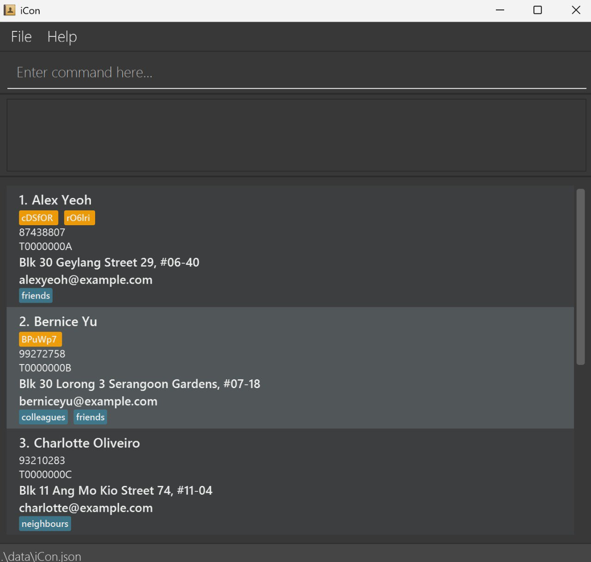

# iCon

**iCon is a desktop application for insurance agents to manage their contacts, contracts, policies and appointments.** While it has a GUI, most of the user interactions happen using a CLI (Command Line Interface).

* If you are interested in using iCon, head over to the [_Quick Start_ section of the **User Guide**](UserGuide.md#quick-start).
* If you are interested about developing iCon, the [**Developer Guide**](DeveloperGuide.md) is a good place to start.

**Acknowledgements**

* Libraries used: [JavaFX](https://openjfx.io/), [Jackson](https://github.com/FasterXML/jackson), [JUnit5](https://github.com/junit-team/junit5)
